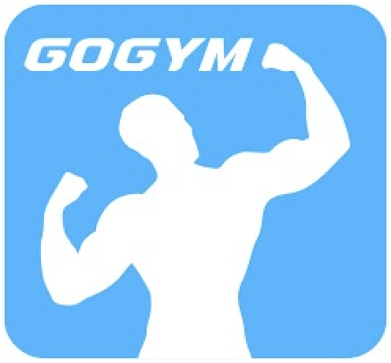

# **DL Large Language Model**
# **Workout Recommendation**

Promoting a healthier lifestyle with personalized workout recommendations, smart scheduling, and fitness guidance.

    
    

        A chatbot designed to guide users on their fitness journey with tailored exercise plans, interactive Q&A, and scheduling assistance.
    

---

## **Introduction 🌟**  

Maintaining a healthy lifestyle in Indonesia faces several challenges:  
1. **Low Physical Activity**: A sedentary lifestyle is prevalent, with many lacking regular exercise routines.  
2. **High Costs**: Gym memberships are often unaffordable for a large portion of the population.  
3. **Preventable Diseases**: Chronic illnesses such as diabetes, obesity, and heart disease are on the rise but can be mitigated through regular physical activity.  

**GoGym** provides an accessible and intelligent solution to these problems by empowering users to take control of their fitness goals with a chatbot that offers workout advice, personalized plans, and answers to fitness-related queries.  

---

## **Features 🚀**  

1. **Interactive Chat**: Communicate with the chatbot to receive fitness advice and workout tips in a user-friendly conversational format.  
2. **Personalized Recommendations**: Generate exercise plans tailored to your preferences, equipment availability, and fitness level.  
3. **Smart Scheduling**: Plan and track your workouts effectively with reminders and goal-setting assistance.  
4. **Fitness Q&A**: Get answers to common fitness questions, from exercise techniques to health benefits.

---

## **How It Works 🏋️**  

### **Step-by-Step Usage**  
1. **Ask a Question**: Type your workout-related question or request in the chat area.  
2. **Submit**: Click the "Submit" button to interact with the chatbot.  
3. **View Recommendations**: Receive customized workout plans, schedules, or answers based on your query.

### **Example Queries**  
Here are some ways to interact with **GoGym**:  
- “Provide a training plan for a month!”  
- “Suggest a 2-week cardio program without equipment.”  
- “How do I perform barbell squats correctly?”  

---

## **Team Members 👨‍💻**  

| **Name**             | **Role**       | **GitHub**                                         |  
|----------------------|----------------|---------------------------------------------------|  
| **Fauzan Azhima**    | Data Analyst   | [GitHub](https://github.com/fauazhima)           |  
| **Muhammad Nuzul**   | Data Scientist | [GitHub](https://github.com/mnuzulbandung)       |  
| **Karmenia Lontoh**  | Data Scientist | [GitHub](https://github.com/karenlontoh)         |  
| **Satrio Tri Nugroho** | Data Engineer | [GitHub](https://github.com/satriotn)            |  

---

## **Technical Overview 🛠️**  

### **Development Process**  
1. **Chatbot Design**: Leveraged **GPT-4o Mini** for natural language understanding and response generation.  
2. **Personalization Algorithm**: Integrated user preference and fitness level data for tailored recommendations.  
3. **Deployment**: Deployed the chatbot on **Hugging Face Spaces** for an interactive user experience.

### **Libraries Used**  
- Python  
- Streamlit  
- Pandas  
- Plotly  
- Hugging Face Transformers  

---

## **Future Enhancements 🌱**  

- **Fitness Progress Tracking**: Add features to log and monitor workout performance.  
- **Nutritional Guidance**: Provide meal plans alongside exercise recommendations.  
- **Multi-Language Support**: Expand chatbot usability for non-English speaking users.  
